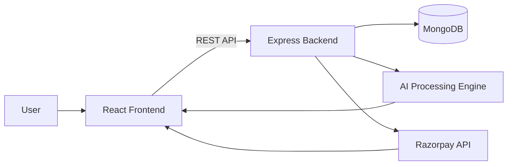
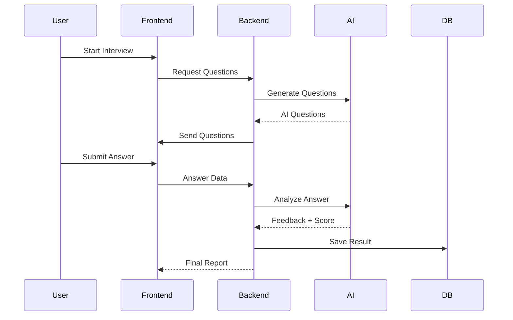

# 🚀 AI Interview Platform (MERN + AI + Razorpay)

<p align="center">
  
</p>

<p align="center">
  
</p>

---

# 🏆 Badges

<p align="center">


</p>

---

# 🌍 Live Demo

## 🚀 Live App

👉 https://ai-interview-two-sigma.vercel.app

---

## 💻 GitHub Repository

👉 https://github.com/suvojitmanna/AI-Interview

---

# 🧠 Project Overview

An advanced AI-powered interview preparation platform built using the MERN Stack, featuring AI-generated questions, real-time voice interviews, analytics, secure payments, and modern premium UI/UX.

---

# ✨ Core Highlights

⚡ AI Generated Interview Questions  
🎤 Real-time Voice Recognition  
📊 Smart Performance Analytics  
💬 AI Feedback System  
🔐 Secure JWT Authentication  
💳 Razorpay Payment Integration  
📱 Fully Responsive Premium UI  
🚀 Smooth Framer Motion Animations  

---

# 🧱 MERN Stack

<p align="center">


</p>

---

# 🧠 System Design (High-Level)



---

# ⚙️ AI Interview Flow



---

# 🔥 Features

# 🤖 AI Interview System

- AI Generated Questions
- Technical + HR Interviews
- Voice Recognition Support
- AI Feedback & Suggestions
- Live Interview Experience
- Smart Scoring System

---

# 📊 Analytics Dashboard

- Performance Tracking
- Skill Analysis
- Score Graphs
- Interview History
- Progress Monitoring

---

# 💳 Payment System

- Razorpay Integration
- Secure Online Payment
- Credits Based Plans
- Premium Subscription System

---

# 🎨 UI/UX

- Modern Premium UI
- Glassmorphism Effects
- Responsive Design
- Smooth Animations
- Interactive Components

---

# 🖼 Demo Preview

<p align="center">


</p>

---

# 📊 GitHub Insights

<p align="center">


</p>

---

# 📈 Contribution Activity

<p align="center">


</p>

---

# 🏆 Achievements

<p align="center">


</p>

---

# 🧩 Project Structure

```bash
client/
│
├── components/
├── pages/
├── redux/
├── assets/
├── hooks/
└── App.jsx

server/
│
├── controllers/
├── routes/
├── middleware/
├── models/
├── config/
├── utils/
└── server.js
```

---

# ⚙️ Installation

## Clone Repository

```bash
git clone https://github.com/suvojitmanna/AI-Interview.git
```

---

# 📦 Install Dependencies

## Frontend

```bash
cd client
npm install
```

---

## Backend

```bash
cd server
npm install
```

---

# ▶️ Run Application

## Start Backend

```bash
npm run server
```

---

## Start Frontend

```bash
npm run dev
```

---

# 🔐 Environment Variables

# Frontend `.env`

```env
VITE_SERVER_URL=http://localhost:8000

VITE_RAZORPAY_KEY=your_razorpay_key
```

---

# Backend `.env`

```env
PORT=8000

MONGO_URI=your_mongodb_uri

JWT_SECRET=your_secret

RAZORPAY_KEY_ID=your_key

RAZORPAY_KEY_SECRET=your_secret
```

---

# 💳 Razorpay Setup

## Install Razorpay

```bash
npm install razorpay
```

---

## Add Razorpay Script

Inside `index.html`

```html
<script src="https://checkout.razorpay.com/v1/checkout.js"></script>
```

---

# 🔗 API Endpoints

| Method | Endpoint | Description |
|--------|----------|-------------|
| POST | /api/auth/register | Register User |
| POST | /api/auth/login | Login User |
| GET | /api/interview | Fetch Interviews |
| POST | /api/interview/start | Start Interview |
| POST | /api/payment/order | Create Payment Order |
| POST | /api/payment/verify | Verify Payment |

---

# 📦 Important Packages

```bash
npm install axios react-router-dom react-hot-toast framer-motion react-icons
```

---

# 🚀 Deployment

# Frontend Deploy

- Vercel
- Netlify

---

# Backend Deploy

- Render
- Railway
- Cyclic

---

# 🔒 Authentication

- JWT Authentication
- Protected Routes
- Secure Cookies
- Google Authentication

---

# 🎯 Future Enhancements

🤖 AI Video Interview  
📄 Resume Upload Analysis  
🌐 Multi Language Support  
🎙 AI Voice Assistant  
📈 Advanced Analytics  
🏆 Leaderboard System  
📱 Mobile Application  

---

# 🤝 Contributing

```bash
git checkout -b feature-name

git commit -m "Add new feature"

git push origin feature-name
```

---

# ⭐ Support

If you like this project:

⭐ Star the Repository  
🍴 Fork the Project  
📢 Share with Friends  

---

# 👨‍💻 Author

# Suvojit Manna

### Full Stack MERN Developer

💻 React Developer  
⚙️ Backend Developer  
🎨 UI/UX Designer  

---

# 📜 License

MIT License

---

# 👁 Visitors

<p align="center">


</p>

---

# 🎯 Footer

<p align="center">


</p>
